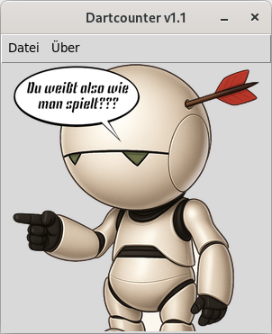
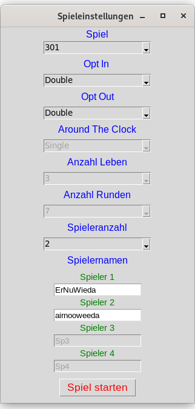
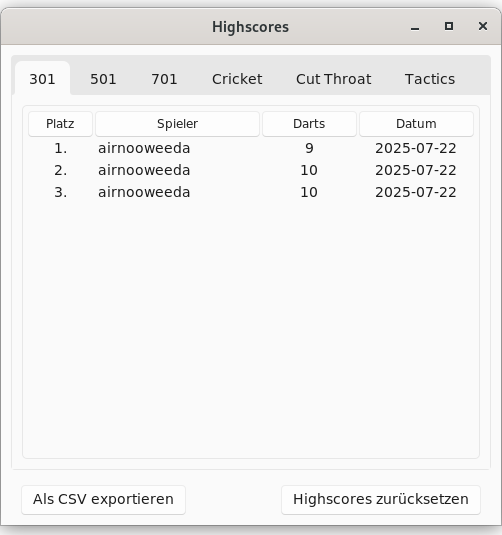
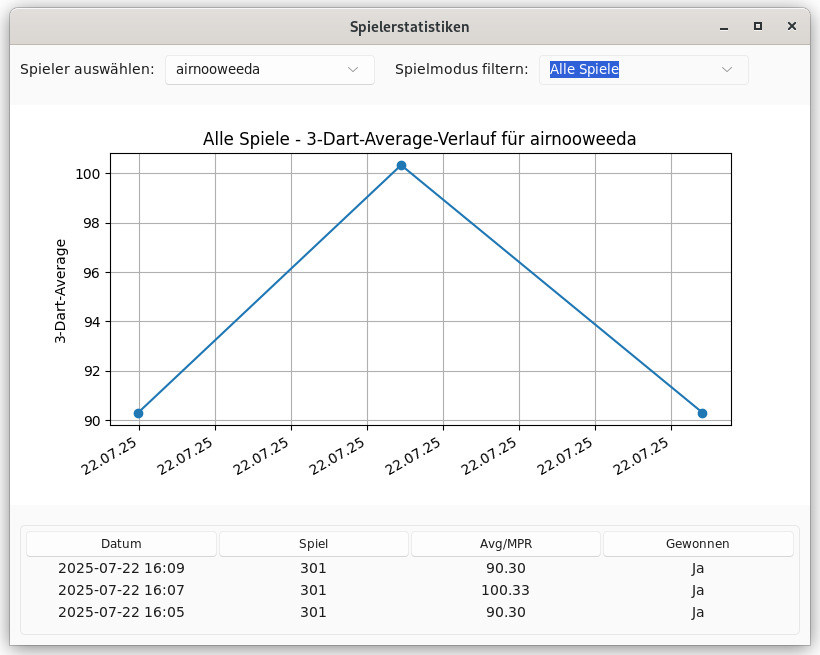
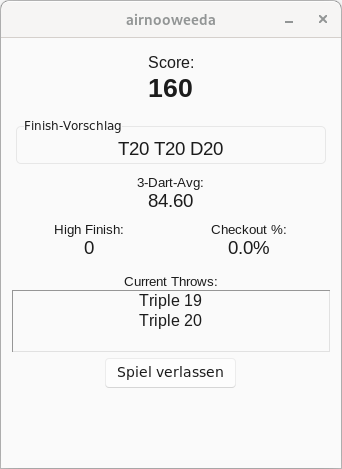
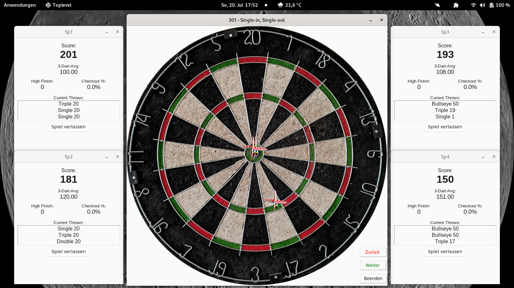

# Dartcounter Deluxe

[](https://github.com/ErNuWieda/DartCounter/actions/workflows/ci.yml)
[](https://www.gnu.org/licenses/gpl-3.0)


Ein einfacher, aber funktionsreicher Dart-Zähler, entwickelt mit Python und Tkinter.
Dieses Projekt zielt darauf ab, eine benutzerfreundliche Oberfläche für verschiedene Dartspiele zu bieten, um das manuelle Zählen von Punkten zu ersetzen.

## Features

*   **Verschiedene Spielmodi:**
    *   **x01 Spiele:** 301, 501, 701 mit Optionen für:
        *   Opt-In: Single, Double, Masters
        *   Opt-Out: Single, Double, Masters
    *   **Cricket:** Standard Cricket und Cut Throat Cricket
    *   **Tactics:** Erweiterte Cricket-Variante (Ziele 10-20 und Bull).
    *   **Around the Clock (ATC):** Mit Varianten für Single, Double, Triple als Ziel
    *   **Micky Maus:** Treffen der Zahlen 20 bis 12 und Bullseye.
    *   **Killer:** Jeder Spieler erhält ein Lebensfeld; Ziel ist es, "Killer" zu werden und andere Spieler zu eliminieren.
    *   **Elimination:** Jeder Spieler spielt von 0 zu einem Zielscore (301, 501), trifft man exakt den Punktestand eines Gegners, wird dieser zurückgesetzt.
    *   **Speichern & Laden:** Laufende Spiele können gespeichert und später fortgesetzt werden.
    *   **Shanghai:** Die Spieler müssen die Zahlen von 1 bis 20 (oder eine andere Rundenzahl) der Reihe nach treffen. Ein "Shanghai" (Single, Double und Triple der aktuellen Zielzahl in einer Runde) führt zum sofortigen Sieg.
*   **Spielerverwaltung:** Unterstützung für bis zu 4 Spieler mit individuellen Namen.
*   **Grafisches Dartboard:** Klickbares Dartboard zur Eingabe der Würfe.
*   **Individuelle Scoreboards:** Jeder Spieler erhält ein eigenes Fenster zur Anzeige des Spielstands und der Wurfhistorie.
*   **Visuelle Dart-Anzeige:** Getroffene Felder werden mit einem Dart-Symbol auf dem Board markiert.
*   **Persistente Spielerstatistiken:** Erfasst die Leistung jedes Spielers über die Zeit und visualisiert den Formverlauf in einem Diagramm.






 

## Systemvoraussetzungen

*   **Python:** Version 3.8 oder neuer.
*   **Git:** Zum Herunterladen (Klonen) des Projekts.
*   **Tkinter:** Ist in den meisten Standard-Python-Installationen für Windows und macOS enthalten. Unter Linux muss es eventuell manuell installiert werden (z.B. `sudo apt install python3-tk` auf Debian/Ubuntu).
*   **PostgreSQL-Server:** (Optional) Wird nur benötigt, wenn Sie die Highscore-Funktion nutzen möchten.

## Installation & Nutzung

### Option A: Für Entwickler (Installation aus dem Quellcode)

Folgen Sie diesen Schritten, wenn Sie den Code selbst ausführen oder weiterentwickeln möchten.

#### Schritt 1: Projekt herunterladen
Öffnen Sie ein Terminal (oder die Kommandozeile/PowerShell unter Windows) und klonen Sie das Repository mit Git an einen Ort Ihrer Wahl.

```bash
git clone https://github.com/ErNuWieda/DartCounter.git
cd DartCounter
```

### Schritt 2: Virtuelle Umgebung einrichten
Eine virtuelle Umgebung isoliert die für dieses Projekt benötigten Python-Pakete von anderen Projekten auf Ihrem System. Dies ist eine bewährte Vorgehensweise.

```bash
# 1. Virtuelle Umgebung im Projektordner erstellen
python3 -m venv .venv

# 2. Umgebung aktivieren
#    - Unter Windows (PowerShell):
#      .\.venv\Scripts\Activate.ps1
#    - Unter Linux/macOS:
source .venv/bin/activate
```
Nach der Aktivierung sollte der Name der Umgebung (z.B. `(.venv)`) am Anfang Ihrer Kommandozeile erscheinen.

### Schritt 3: Notwendige Pakete installieren
Installieren Sie alle Python-Abhängigkeiten, die in der `requirements.txt`-Datei aufgelistet sind.

```bash
# Stellen Sie sicher, dass Ihre virtuelle Umgebung aktiv ist
pip install -r requirements.txt
```

### Schritt 4: PostgreSQL-Datenbank einrichten (Optional)
Dieser Schritt ist nur notwendig, wenn Sie die Highscore-Funktion nutzen möchten. Wenn Sie dies nicht möchten, können Sie direkt zu **Schritt 5** springen.

#### 4.1. PostgreSQL installieren

*   **Windows:**
    1.  Laden Sie den PostgreSQL-Installer von EDB herunter.
    2.  Führen Sie den Installer aus. Während der Installation werden Sie aufgefordert, ein Passwort für den Superuser (`postgres`) festzulegen. **Merken Sie sich dieses Passwort gut!**
    3.  Die übrigen Einstellungen können auf den Standardwerten belassen werden.

*   **macOS (mit Homebrew):**
```bash
    # PostgreSQL installieren
    brew install postgresql
    # PostgreSQL-Dienst starten
    brew services start postgresql
```

*   **Linux (Debian/Ubuntu):**
```bash
    sudo apt update
    sudo apt install postgresql postgresql-contrib
```

#### 4.2. Datenbank und Benutzer erstellen
Nach der Installation müssen eine Datenbank und ein Benutzer für die Anwendung erstellt werden. Öffnen Sie dazu das `psql`-Terminal:
*   **Windows:** Suchen Sie im Startmenü nach "SQL Shell (psql)" und öffnen Sie es. Bestätigen Sie die Standardwerte für Server, Datenbank, Port und Benutzername mit Enter und geben Sie das bei der Installation festgelegte Passwort ein.
*   **macOS/Linux:** Führen Sie im Terminal `sudo -u postgres psql` aus.

Geben Sie nun die folgenden SQL-Befehle nacheinander ein und bestätigen Sie jeden mit Enter:

```sql
-- Erstellt die Datenbank (der Name ist frei wählbar, muss aber zur config.ini passen)
CREATE DATABASE dartcounter;

-- Erstellt einen neuen Benutzer mit einem Passwort (Namen und Passwort frei wählen)
CREATE USER darter WITH PASSWORD 'TopSecret';

-- Gibt dem neuen Benutzer alle Rechte für die neue Datenbank
GRANT ALL PRIVILEGES ON DATABASE dartcounter TO darter;

-- Verlassen der psql-Shell
\q
```

#### 4.3. Konfigurationsdatei anpassen
1.  Erstellen Sie eine Kopie der Datei `config.ini.example` und nennen Sie diese `config.ini`.
2.  Öffnen Sie die neue `config.ini` und tragen Sie die Zugangsdaten ein, die Sie in Schritt 4.2 festgelegt haben.

3.  **Speicherort der `config.ini`:**
    *   **Für die Entwicklung:** Platzieren Sie die `config.ini` im Hauptverzeichnis des Projekts (neben `main.py`).
    *   **Für eine installierte Anwendung:** Platzieren Sie die `config.ini` im benutzerspezifischen Anwendungsordner, damit sie bei Updates nicht überschrieben wird. Die Anwendung sucht dort zuerst. Sie finden den Ordner hier:
        *   **Windows:** `%APPDATA%\DartCounter` (z.B. `C:\Users\<IhrName>\AppData\Roaming\DartCounter`)
        *   **macOS:** `~/Library/Application Support/DartCounter`
        *   **Linux:** `~/.config/dartcounter`

**Beispiel für `config.ini`:**
```ini
[postgresql]
host = localhost
database = dartcounter
user = darter
password = TopSecret
```

### Schritt 5: Anwendung starten
Stellen Sie sicher, dass Ihre virtuelle Umgebung noch aktiv ist, und starten Sie die Anwendung.

```bash
python3 main.py
```
### Option B: Als ausführbare Datei paketieren (für die Weitergabe)

Wenn Sie eine eigenständige, ausführbare Datei (z.B. eine .exe für Windows) erstellen möchten, die Sie ohne installierte Python-Umgebung an andere weitergeben können, können Sie das mitgelieferte Build-Skript verwenden. Dieses Skript nutzt PyInstaller, um alle notwendigen Code- und Asset-Dateien in ein einziges Paket zu bündeln. 

#### Schritt 1-3: Vorbereitung 
Führen Sie die Schritte 1 bis 3 aus der "Option A" aus, um das Projekt herunterzuladen, eine virtuelle Umgebung einzurichten und die Abhängigkeiten (inklusive pyinstaller) zu installieren.

#### Schritt 4: Build-Skript ausführen 
Stellen Sie sicher, dass Ihre virtuelle Umgebung aktiv ist, und führen Sie dann das Build-Skript aus: 

```bash
python3 build.py
```

Das Skript erledigt automatisch die folgenden Aufgaben: 
1. Es erkennt Ihr Betriebssystem (Windows, macOS oder Linux). 
2. Es bereinigt alte Build-Dateien. 
3. Es führt PyInstaller mit den korrekten Einstellungen aus, um die Anwendung zu bauen. 
4. Es erstellt ein Release-Verzeichnis, kopiert die ausführbare Datei, die README.md und eine config.ini.example hinein. 
5. Es packt alles in eine ZIP-Datei, z.B. DartCounter_Windows_v1.2.0.zip. 
6. Anschließend werden alle temporären Build-Ordner wieder gelöscht. 

#### Schritt 5: Ergebnis finden 
Nachdem das Skript erfolgreich durchgelaufen ist, finden Sie im Hauptverzeichnis des Projekts eine ZIP-Datei. Diese Datei enthält die fertige Anwendung und kann an andere Benutzer weitergegeben werden.

### Option C: Windows-Installer erstellen (mit Inno Setup)

Nachdem Sie die ausführbare Datei mit Option B erstellt haben, können Sie einen professionellen Windows-Installer (`setup.exe`) erstellen. Dies bietet Benutzern eine vertraute Installationserfahrung, inklusive Startmenü-Einträgen und einer Deinstallationsroutine.

#### Schritt 1: Inno Setup installieren
Laden und installieren Sie den Inno Setup Compiler von der offiziellen Webseite: https://jrsoftware.org/isinfo.php

#### Schritt 2: Anwendungsdateien vorbereiten
1.  Führen Sie das Build-Skript wie in "Option B" beschrieben aus: `python build.py`.
2.  Entpacken Sie die resultierende ZIP-Datei (z.B. `DartCounter_Windows_v1.2.0.zip`) in einen Ordner. Dieser Ordner enthält die `DartCounter.exe` und alle zugehörigen Dateien.

#### Schritt 3: Installer-Skript anpassen und kompilieren
1.  Im Projektverzeichnis finden Sie den Ordner `installer` mit der Datei `create_installer.iss`.
2.  Öffnen Sie `create_installer.iss` mit einem Texteditor.
3.  **WICHTIG:** Passen Sie in der `[Files]`-Sektion den `Source`-Pfad an. Er muss auf den Ordner zeigen, den Sie in Schritt 2 entpackt haben.
    ```pascal
    [Files]
    ; Passen Sie den folgenden Pfad an!
    Source: "C:\Pfad\zu\Ihren\entpackten\Build-Dateien\*"; DestDir: "{app}"; Flags: ignoreversion recursesubdirs createallsubdirs
    ```
4.  Speichern Sie die Datei.
5.  Klicken Sie mit der rechten Maustaste auf die `create_installer.iss`-Datei und wählen Sie "Compile" oder öffnen Sie sie mit dem Inno Setup Compiler und klicken Sie auf den "Compile"-Button (blauer Play-Button).

#### Schritt 4: Ergebnis
Inno Setup erstellt eine einzelne `setup.exe`-Datei im `installer/Output`-Verzeichnis. Diese Datei können Sie an Windows-Benutzer weitergeben.

---

## Contributing & Support

Dieses Projekt lebt von der Community. Beiträge sind herzlich willkommen!

*   **Fehler melden & Wünsche äußern:** Erstelle einfach ein [Issue](https://github.com/ErNuWieda/DartCounter/issues).
*   **Code beitragen:** Forke das Repository und erstelle einen [Pull Request](https://github.com/ErNuWieda/DartCounter/pulls).

Wenn dir dieses Projekt gefällt und du die Weiterentwicklung unterstützen möchtest, kannst du dem Entwickler einen Kaffee spendieren. Jede Unterstützung wird sehr geschätzt!

*(Platzhalter für einen zukünftigen "Donate"-Button)*

---

## Danksagung

Ein besonderer Dank geht an **Gemini Code Assist**. Die Unterstützung durch diesen KI-Coding-Assistenten war bei der Entwicklung, Fehlersuche, Strukturierung des Codes und der Erstellung von Dokumentation von unschätzbarem Wert. Viele der Implementierungen und Verbesserungen wurden durch die Vorschläge und Hilfestellungen von Gemini maßgeblich beschleunigt und qualitativ verbessert.

## Lizenz

Dieses Projekt steht unter der GNU General Public License v3.0. Details finden Sie in der Datei `LICENSE`.

---

Wir freuen uns über Beiträge, Fehlermeldungen und Vorschläge! Erstelle einfach ein Issue oder einen Pull Request.
Viel Spaß beim Darten! 🎯