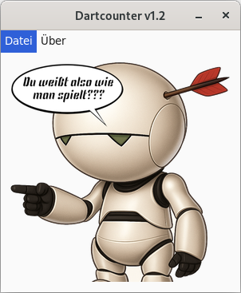

# Dartcounter Deluxe

Ein einfacher, aber funktionsreicher Dart-Zähler, entwickelt mit Python und Tkinter.
Dieses Projekt zielt darauf ab, eine benutzerfreundliche Oberfläche für verschiedene Dartspiele zu bieten, um das manuelle Zählen von Punkten zu ersetzen.

## Features

*   **Verschiedene Spielmodi:**
    *   **x01 Spiele:** 301, 501, 701 mit Optionen für:
        *   Opt-In: Single, Double, Masters
        *   Opt-Out: Single, Double, Masters
    *   **Cricket:** Standard Cricket und Cut Throat Cricket
    *   **Tactics:** Erweiterte Cricket-Variante (Ziele 10-20 und Bull).
    *   **Around the Clock (ATC):** Mit Varianten für Single, Double, Triple als Ziel
    *   **Micky Maus:** Treffen der Zahlen 20 bis 12 und Bullseye.
    *   **Killer:** Jeder Spieler erhält ein Lebensfeld; Ziel ist es, "Killer" zu werden und andere Spieler zu eliminieren.
    *   **Elimination:** Jeder Spieler spielt von einem Startscore (z. B. 301) auf 0 – trifft man exakt den Punktestand eines Gegners, wird dieser zurückgesetzt.

    *   **Shanghai:** Jeder Spieler versucht mit genau drei Darts die Zahlen 1 bis 7 (oder bis 20 bzw. Anzahl vereinbarter Runden) der Reihe nach zu treffen – idealerweise mit einem Single, Double und Triple derselben Zahl in einer Runde, was sofort zum Sieg führt (ein sogenannter "Shanghai")    
*   **Spielerverwaltung:** Unterstützung für bis zu 4 Spieler mit individuellen Namen.
*   **Grafisches Dartboard:** Klickbares Dartboard zur Eingabe der Würfe.
*   **Individuelle Scoreboards:** Jeder Spieler erhält ein eigenes Fenster zur Anzeige des Spielstands und der Wurfhistorie.
*   **Visuelle Dart-Anzeige:** Getroffene Felder werden mit einem Dart-Symbol auf dem Board markiert.


 

## Systemvoraussetzungen

*   **Python:** Version 3.8 oder neuer.
*   **Git:** Zum Herunterladen (Klonen) des Projekts.
*   **Tkinter:** Ist in den meisten Standard-Python-Installationen für Windows und macOS enthalten. Unter Linux muss es eventuell manuell installiert werden (z.B. `sudo apt install python3-tk` auf Debian/Ubuntu).
*   **PostgreSQL-Server:** (Optional) Wird nur benötigt, wenn Sie die Highscore-Funktion nutzen möchten.

## Installation & Einrichtung (Schritt-für-Schritt)

### Schritt 1: Projekt herunterladen
Öffnen Sie ein Terminal (oder die Kommandozeile/PowerShell unter Windows) und klonen Sie das Repository mit Git an einen Ort Ihrer Wahl.

```bash
git clone https://github.com/ErNuWieda/DartCounter.git
cd DartCounter
```

### Schritt 2: Virtuelle Umgebung einrichten
Eine virtuelle Umgebung isoliert die für dieses Projekt benötigten Python-Pakete von anderen Projekten auf Ihrem System. Dies ist eine bewährte Vorgehensweise.

```bash
# 1. Virtuelle Umgebung im Projektordner erstellen
python3 -m venv .venv

# 2. Umgebung aktivieren
#    - Unter Windows (PowerShell):
#      .\.venv\Scripts\Activate.ps1
#    - Unter Linux/macOS:
source .venv/bin/activate
```
Nach der Aktivierung sollte der Name der Umgebung (z.B. `(.venv)`) am Anfang Ihrer Kommandozeile erscheinen.

### Schritt 3: Notwendige Pakete installieren
Installieren Sie alle Python-Abhängigkeiten, die in der `requirements.txt`-Datei aufgelistet sind.

```bash
# Stellen Sie sicher, dass Ihre virtuelle Umgebung aktiv ist
pip install -r requirements.txt
```

### Schritt 4: PostgreSQL-Datenbank einrichten (Optional)
Dieser Schritt ist nur notwendig, wenn Sie die Highscore-Funktion nutzen möchten. Wenn Sie dies nicht möchten, können Sie direkt zu **Schritt 5** springen.

#### 4.1. PostgreSQL installieren

*   **Windows:**
    1.  Laden Sie den PostgreSQL-Installer von EDB herunter.
    2.  Führen Sie den Installer aus. Während der Installation werden Sie aufgefordert, ein Passwort für den Superuser (`postgres`) festzulegen. **Merken Sie sich dieses Passwort gut!**
    3.  Die übrigen Einstellungen können auf den Standardwerten belassen werden.

*   **macOS (mit Homebrew):**
    ```bash
    # PostgreSQL installieren
    brew install postgresql
    # PostgreSQL-Dienst starten
    brew services start postgresql
    ```

*   **Linux (Debian/Ubuntu):**
    ```bash
    sudo apt update
    sudo apt install postgresql postgresql-contrib
    ```

#### 4.2. Datenbank und Benutzer erstellen
Nach der Installation müssen eine Datenbank und ein Benutzer für die Anwendung erstellt werden. Öffnen Sie dazu das `psql`-Terminal:
*   **Windows:** Suchen Sie im Startmenü nach "SQL Shell (psql)" und öffnen Sie es. Bestätigen Sie die Standardwerte für Server, Datenbank, Port und Benutzername mit Enter und geben Sie das bei der Installation festgelegte Passwort ein.
*   **macOS/Linux:** Führen Sie im Terminal `sudo -u postgres psql` aus.

Geben Sie nun die folgenden SQL-Befehle nacheinander ein und bestätigen Sie jeden mit Enter:

```sql
-- Erstellt die Datenbank (der Name ist frei wählbar, muss aber zur config.ini passen)
CREATE DATABASE dartcounter;

-- Erstellt einen neuen Benutzer mit einem Passwort (Namen und Passwort frei wählen)
CREATE USER darter WITH PASSWORD 'TopSecret';

-- Gibt dem neuen Benutzer alle Rechte für die neue Datenbank
GRANT ALL PRIVILEGES ON DATABASE dartcounter TO darter;

-- Verlassen der psql-Shell
\q
```

#### 4.3. Konfigurationsdatei anpassen
1.  Erstellen Sie eine Kopie der Datei `config.ini.example` und nennen Sie diese `config.ini`.
2.  Öffnen Sie die neue `config.ini` und tragen Sie die Zugangsdaten ein, die Sie in Schritt 4.2 festgelegt haben.

**Beispiel für `config.ini`:**
```ini
[postgresql]
host = localhost
database = dartcounter
user = darter
password = TopSecret
```

### Schritt 5: Anwendung starten
Stellen Sie sicher, dass Ihre virtuelle Umgebung noch aktiv ist, und starten Sie die Anwendung.

```bash
python3 main.py
```

## TODO - Zukünftige Features & Verbesserungen

Das Projekt befindet sich in aktiver Entwicklung. Hier sind einige geplante Features und Bereiche für Verbesserungen:
*   **[X] Verbesserung Undo:** Implementierung der Undo-Funktion für "Finish"-Darts 
*   **[X] Spielerstatistiken:**
    *   **[X] Erfassung und Anzeige des 3-Dart-Average für X01-Spiele.**
    *   **[X] Erweiterung um Checkout-Quoten und höchste Würfe.**
*   **[X] Highscore-Listen:**
    *   **[X] Implementierung einer Highscore-Liste für X01-Spiele (lokale Datei).**
    *   **[X] Anbindung an eine PostgreSQL-Datenbank zur persistenten Speicherung der Highscores.**
*   **[X] Soundeffekte:** Soundeffekte für Treffer und Spielgewinn (aktivier-/deaktivierbar).
*   **[X] Highscore-Export:** Export der Highscores in eine CSV-Datei.
*   **[X] Highscore-Reset:** Zurücksetzen der Highscores pro Modus oder insgesamt.
*   **[X] Spieler entfernen:** Spieler können ein laufendes Spiel verlassen.
*   **[X] Anwendungseinstellungen:**
    *   **[X] Einstellungen (z.B. Sound an/aus) werden gespeichert.**
    *   **[X] Zuletzt verwendete Spielernamen werden gespeichert.**
*   **[X] UI/UX Verbesserungen:**
    *   **[X] Modernisierung des Designs mit hellem und dunklem Theme.**
    *   **[X] Verbesserte Fehlerbehandlung und Nutzerfeedback.**
*   **[X] Speichern/Laden von Spielständen:** Laufende Spiele können gespeichert und später fortgesetzt werden.
*   **[X] Code-Refactoring & Optimierungen:**
    *   Weitere Modularisierung und Vereinfachung von Code-Abschnitten.
*   **[X] Ausführliche Testabdeckung:** Erstellung von Unit-Tests und Integrationstests.

## Danksagung

Ein besonderer Dank geht an **Gemini Code Assist**. Die Unterstützung durch diesen KI-Coding-Assistenten war bei der Entwicklung, Fehlersuche, Strukturierung des Codes und der Erstellung von Dokumentation von unschätzbarem Wert. Viele der Implementierungen und Verbesserungen wurden durch die Vorschläge und Hilfestellungen von Gemini maßgeblich beschleunigt und qualitativ verbessert.

## Lizenz

Dieses Projekt steht unter der MIT-Lizenz. Details finden Sie in der Datei `LICENSE`.

---

Wir freuen uns über Beiträge, Fehlermeldungen und Vorschläge! Erstelle einfach ein Issue oder einen Pull Request.
Viel Spaß beim Darten! 🎯