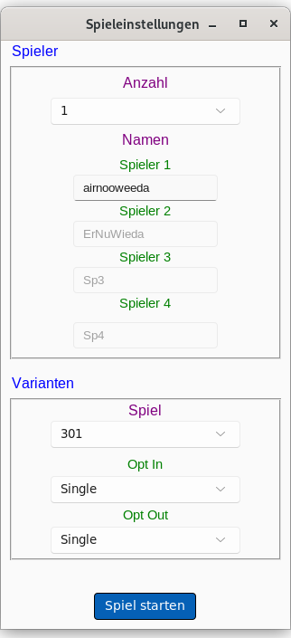

# Dartcounter Deluxe

Ein einfacher, aber funktionsreicher Dart-Zähler, entwickelt mit Python und Tkinter.
Dieses Projekt zielt darauf ab, eine benutzerfreundliche Oberfläche für verschiedene Dartspiele zu bieten, um das manuelle Zählen von Punkten zu ersetzen.

## Features

*   **Verschiedene Spielmodi:**
    *   **x01 Spiele:** 301, 501, 701 mit Optionen für:
        *   Opt-In: Single, Double, Masters
        *   Opt-Out: Single, Double, Masters
    *   **Cricket:** Standard Cricket und Cut Throat Cricket
    *   **Tactics:** Erweiterte Cricket-Variante (Ziele 10-20 und Bull).
    *   **Around the Clock (ATC):** Mit Varianten für Single, Double, Triple als Ziel
    *   **Micky Maus:** Treffen der Zahlen 20 bis 12 und Bullseye.
    *   **Killer:** Jeder Spieler erhält ein Lebensfeld; Ziel ist es, "Killer" zu werden und andere Spieler zu eliminieren.
    *   **Elimination:** Jeder Spieler spielt von einem Startscore (z. B. 301) auf 0 – trifft man exakt den Punktestand eines Gegners, wird dieser zurückgesetzt.

    *   **Shanghai:** Jeder Spieler versucht mit genau drei Darts die Zahlen 1 bis 7 (oder bis 20 bzw. Anzahl vereinbarter Runden) der Reihe nach zu treffen – idealerweise mit einem Single, Double und Triple derselben Zahl in einer Runde, was sofort zum Sieg führt (ein sogenannter "Shanghai")    
*   **Spielerverwaltung:** Unterstützung für bis zu 4 Spieler mit individuellen Namen.
*   **Grafisches Dartboard:** Klickbares Dartboard zur Eingabe der Würfe.
*   **Individuelle Scoreboards:** Jeder Spieler erhält ein eigenes Fenster zur Anzeige des Spielstands und der Wurfhistorie.
*   **Visuelle Dart-Anzeige:** Getroffene Felder werden mit einem Dart-Symbol auf dem Board markiert.


 

## Installation & Ausführung

1.  **Voraussetzungen:**
    *   Python 3.x
    *   Tkinter (ist normalerweise bei Standard-Python-Installationen dabei)
    *   `python3-venv` (auf Debian/Ubuntu: `sudo apt install python3-venv`)

2.  **Klonen des Repositories:**
    ```bash
    git clone https://github.com/ErNuWieda/DartCounter.git
    cd dartcounter
    ```

3.  **Virtuelle Umgebung einrichten und Abhängigkeiten installieren:**
    ```bash
    # Virtuelle Umgebung erstellen
    python3 -m venv .venv
    # Umgebung aktivieren (unter Linux/macOS)
    source .venv/bin/activate
    # Alle benötigten Pakete installieren
    pip install -r requirements.txt
    ```

4.  **Datenbank einrichten (optional, für Highscores):**
    *   Stelle sicher, dass ein PostgreSQL-Server läuft.
    *   Erstelle eine Datenbank (z.B. `dartcounter`).
    *   Erstelle eine Kopie der `config.ini.example`, nenne sie `config.ini` und trage deine Datenbank-Zugangsdaten ein.

5.  **Starten der Anwendung (mit aktivierter virtueller Umgebung):**
    ```bash
    python main.py
    ```

## TODO - Zukünftige Features & Verbesserungen

Das Projekt befindet sich in aktiver Entwicklung. Hier sind einige geplante Features und Bereiche für Verbesserungen:
*   **[X] Verbesserung Undo:** Implementierung der Undo-Funktion für "Finish"-Darts 
*   **[X] Spielerstatistiken:**
    *   **[X] Erfassung und Anzeige des 3-Dart-Average für X01-Spiele.**
    *   **[X] Erweiterung um Checkout-Quoten und höchste Würfe.**
*   **[X] Highscore-Listen:**
    *   **[X] Implementierung einer Highscore-Liste für X01-Spiele (lokale Datei).**
    *   **[X] Anbindung an eine PostgreSQL-Datenbank zur persistenten Speicherung der Highscores.**
*   **[X] Soundeffekte:** Soundeffekte für Treffer und Spielgewinn (aktivier-/deaktivierbar).
*   **[X] Highscore-Export:** Export der Highscores in eine CSV-Datei.
*   **[X] Highscore-Reset:** Zurücksetzen der Highscores pro Modus oder insgesamt.
*   **[X] Spieler entfernen:** Spieler können ein laufendes Spiel verlassen.
*   **[X] Anwendungseinstellungen:**
    *   **[X] Einstellungen (z.B. Sound an/aus) werden gespeichert.**
    *   **[X] Zuletzt verwendete Spielernamen werden gespeichert.**
*   **[X] UI/UX Verbesserungen:**
    *   **[X] Modernisierung des Designs mit hellem und dunklem Theme.**
    *   **[X] Verbesserte Fehlerbehandlung und Nutzerfeedback.**
*   **[X] Speichern/Laden von Spielständen:** Laufende Spiele können gespeichert und später fortgesetzt werden.
*   **[X] Code-Refactoring & Optimierungen:**
    *   Weitere Modularisierung und Vereinfachung von Code-Abschnitten.
*   **[X] Ausführliche Testabdeckung:** Erstellung von Unit-Tests und Integrationstests.

## Danksagung

Ein besonderer Dank geht an **Gemini Code Assist**. Die Unterstützung durch diesen KI-Coding-Assistenten war bei der Entwicklung, Fehlersuche, Strukturierung des Codes und der Erstellung von Dokumentation von unschätzbarem Wert. Viele der Implementierungen und Verbesserungen wurden durch die Vorschläge und Hilfestellungen von Gemini maßgeblich beschleunigt und qualitativ verbessert.

## Lizenz

Dieses Projekt steht unter der MIT-Lizenz. Details finden Sie in der Datei `LICENSE`.

---

Wir freuen uns über Beiträge, Fehlermeldungen und Vorschläge! Erstelle einfach ein Issue oder einen Pull Request.
Viel Spaß beim Darten! 🎯